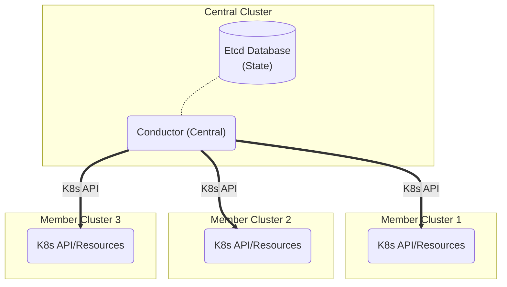

```mermaid
flowchart TD
    %% 1. The Central Cluster
    subgraph Central ["Central Cluster"]
        direction LR
        C_ETCD[("Etcd Database
        (State)")]
        C_Agent("Conductor (Central)")

        C_ETCD -.- C_Agent
    end

    %% 2. Member Cluster 1
    subgraph Cluster_1 ["Member Cluster 1"]
        M1_K8s("K8s API/Resources")
    end

    %% 3. Member Cluster 2
    subgraph Cluster_2 ["Member Cluster 2"]
        M2_K8s("K8s API/Resources")
    end

    %% 4. Member Cluster 3
    subgraph Cluster_3 ["Member Cluster 3"]
        M3_K8s("K8s API/Resources")
    end

    %% --- CROSS-CLUSTER COMMUNICATION ---

    %% Central Conductor talks directly to member K8s API servers
    C_Agent == "K8s API" ==> M1_K8s
    C_Agent == "K8s API" ==> M2_K8s
    C_Agent == "K8s API" ==> M3_K8s

    %% Balance layout: invisible link from etcd toward middle
    C_ETCD ~~~ M2_K8s

    class C_Agent agent;
    class C_ETCD db;

```
