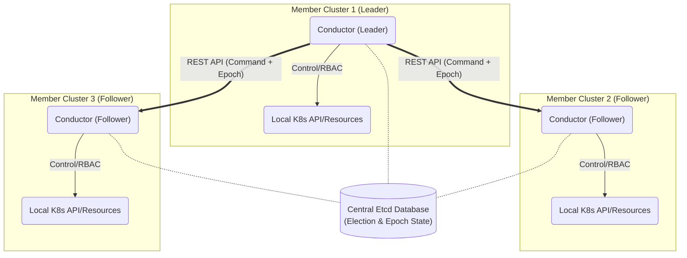

```mermaid
flowchart TD
    %% 1. The Central Database
    ETCD[("Central Etcd Database
    (Election & Epoch State)")]

    %% 2. The Leader Cluster Scope
    subgraph Cluster_1 ["Member Cluster 1 (Leader)"]
        direction TB
        L_Agent("Conductor (Leader)")
        L_K8s("Local K8s API/Resources")

        %% Local Communication
        L_Agent -->|Control/RBAC| L_K8s
    end

    %% 3. The Follower Cluster Scope
    subgraph Cluster_2 ["Member Cluster 2 (Follower)"]
        direction TB
        F1_Agent("Conductor (Follower)")
        F1_K8s("Local K8s API/Resources")

        %% Local Communication
        F1_Agent -->|Control/RBAC| F1_K8s
    end

    %% 4. The Second Follower (to show 1-to-many)
    subgraph Cluster_3 ["Member Cluster 3 (Follower)"]
        direction TB
        F2_Agent("Conductor (Follower)")
        F2_K8s("Local K8s API/Resources")

        %% Local Communication
        F2_Agent -->|Control/RBAC| F2_K8s
    end

    %% --- CROSS-CLUSTER COMMUNICATION (Minimizing Arrows) ---

    %% Leader commands Followers (REST API)
    L_Agent == "REST API (Command + Epoch)" ==> F1_Agent
    L_Agent == "REST API (Command + Epoch)" ==> F2_Agent

    %% All Nodes Talk to Etcd (Dashed to distinguish from task flow)
    L_Agent -.- ETCD
    F1_Agent -.- ETCD
    F2_Agent -.- ETCD


    class L_Agent,F1_Agent,F2_Agent agent;
    class ETCD db;

```
