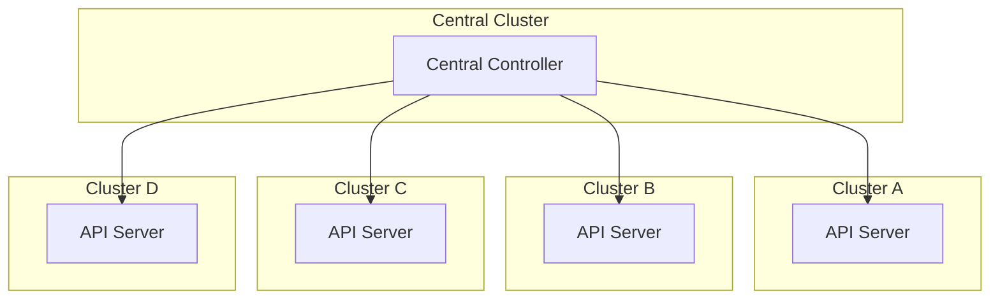
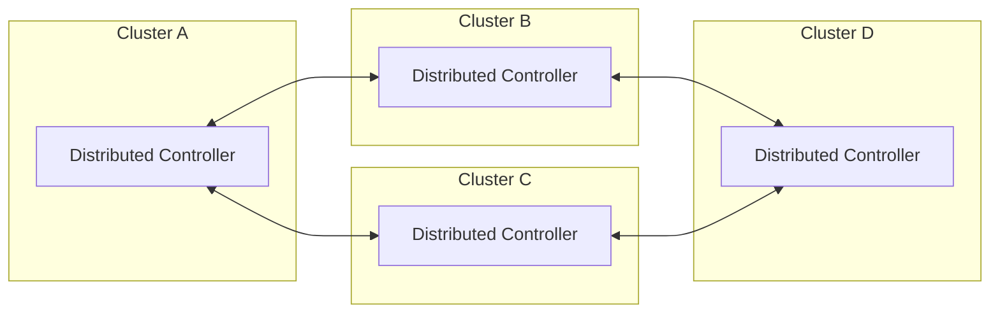

```mermaid
flowchart TB
  subgraph CC[Central Cluster]
    CI[Central Controller]
  end

  subgraph CA[Cluster A]
    A_API[API Server]
  end

  subgraph CB[Cluster B]
    B_API[API Server]
  end

  subgraph CC1[Cluster C]
    C_API[API Server]
  end

  subgraph CD[Cluster D]
    D_API[API Server]
  end

  CI --> A_API
  CI --> B_API
  CI --> C_API
  CI --> D_API

```

```mermaid
flowchart LR
  subgraph A[Cluster A]
    A1[Distributed Controller]
  end

  subgraph B[Cluster B]
    B1[Distributed Controller]
  end

  subgraph C[Cluster C]
    C1[Distributed Controller]
  end

  subgraph D[Cluster D]
    D1[Distributed Controller]
  end

  A1 <--> B1
  A1 <--> C1
  B1 <--> D1
  C1 <--> D1
```