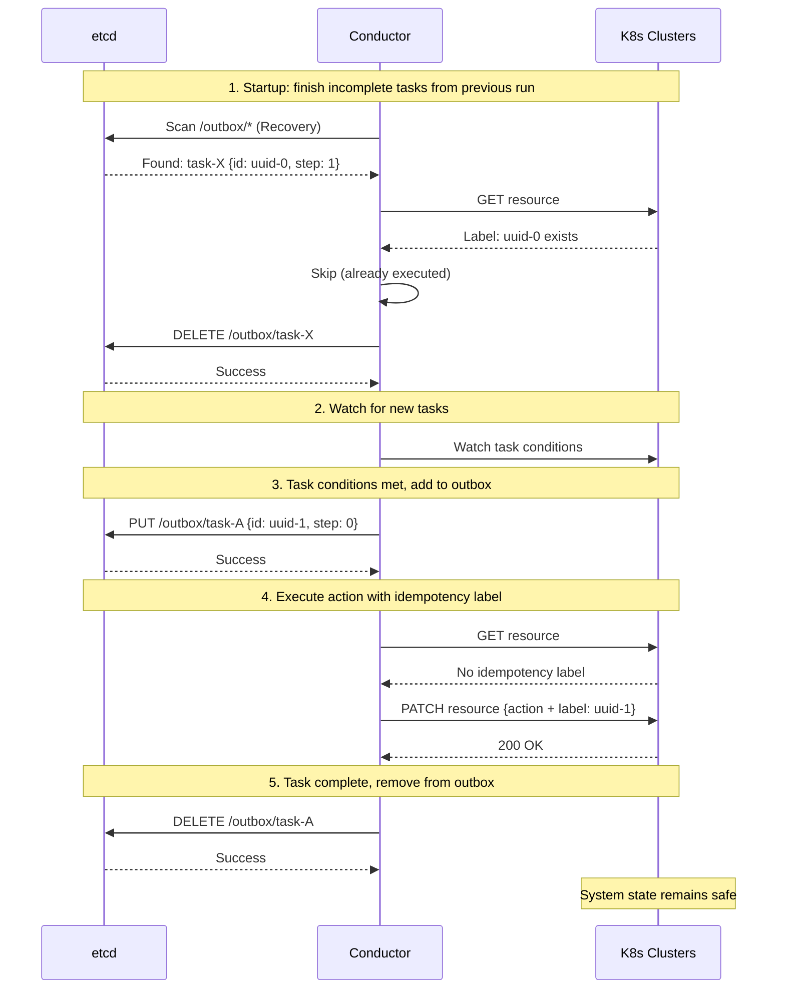

```mermaid
sequenceDiagram
    participant DB as etcd
    participant Conductor as Conductor
    participant K8s as K8s Clusters

    Note over DB, K8s: 1. Startup: finish incomplete tasks from previous run

    Conductor->>DB: Scan /outbox/* (Recovery)
    DB-->>Conductor: Found: task-X {id: uuid-0, step: 1}
    Conductor->>K8s: GET resource
    K8s-->>Conductor: Label: uuid-0 exists
    Conductor->>Conductor: Skip (already executed)
    Conductor->>DB: DELETE /outbox/task-X
    DB-->>Conductor: Success

    Note over DB, K8s: 2. Watch for new tasks

    Conductor->>K8s: Watch task conditions

    Note over DB, K8s: 3. Task conditions met, add to outbox

    Conductor->>DB: PUT /outbox/task-A {id: uuid-1, step: 0}
    DB-->>Conductor: Success

    Note over DB, K8s: 4. Execute action with idempotency label

    Conductor->>K8s: GET resource
    K8s-->>Conductor: No idempotency label
    Conductor->>K8s: PATCH resource {action + label: uuid-1}
    K8s-->>Conductor: 200 OK

    Note over DB, K8s: 5. Task complete, remove from outbox

    Conductor->>DB: DELETE /outbox/task-A
    DB-->>Conductor: Success

    Note over K8s: System state remains safe
```
