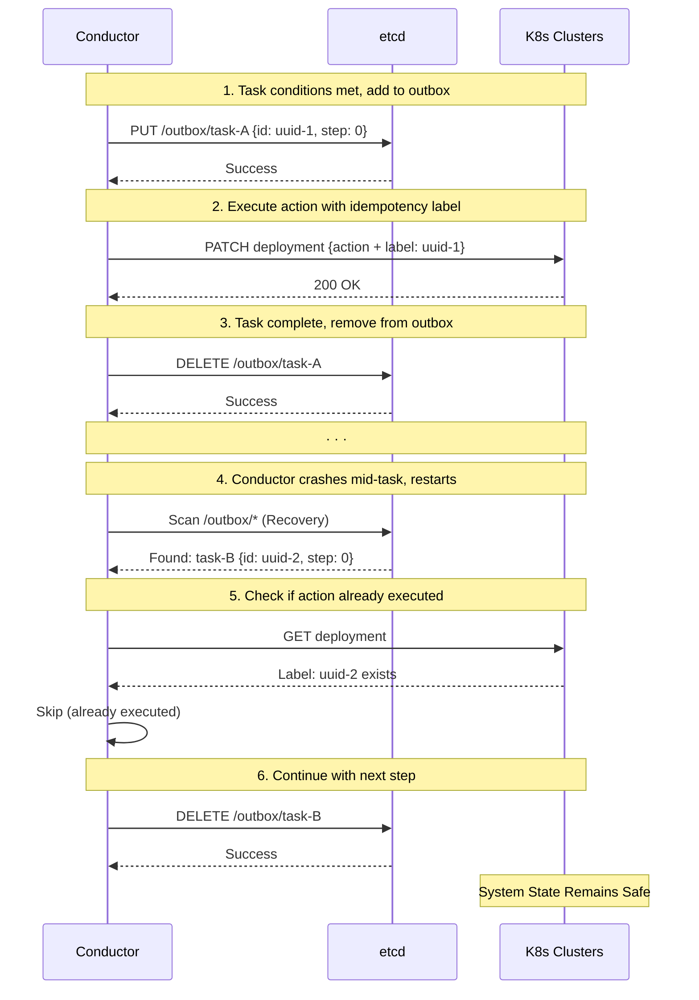

```mermaid
sequenceDiagram
    participant Conductor as Conductor
    participant DB as etcd
    participant K8s as K8s Clusters

    Note over Conductor, K8s: 1. Task conditions met, add to outbox

    Conductor->>DB: PUT /outbox/task-A {id: uuid-1, step: 0}
    DB-->>Conductor: Success

    Note over Conductor, K8s: 2. Execute action with idempotency label

    Conductor->>K8s: PATCH deployment {action + label: uuid-1}
    K8s-->>Conductor: 200 OK

    Note over Conductor, K8s: 3. Task complete, remove from outbox

    Conductor->>DB: DELETE /outbox/task-A
    DB-->>Conductor: Success

    Note over Conductor, K8s: · · ·

    Note over Conductor, K8s: 4. Conductor crashes mid-task, restarts

    Conductor->>DB: Scan /outbox/* (Recovery)
    DB-->>Conductor: Found: task-B {id: uuid-2, step: 0}

    Note over Conductor, K8s: 5. Check if action already executed

    Conductor->>K8s: GET deployment
    K8s-->>Conductor: Label: uuid-2 exists
    Conductor->>Conductor: Skip (already executed)

    Note over Conductor, K8s: 6. Continue with next step

    Conductor->>DB: DELETE /outbox/task-B
    DB-->>Conductor: Success

    Note over K8s: System State Remains Safe
```
