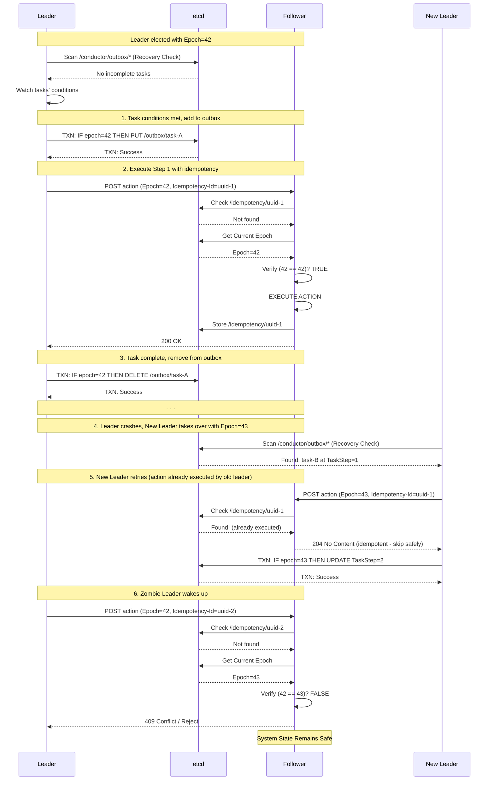

```mermaid
sequenceDiagram
participant Leader as Leader
participant DB as etcd
participant Follower as Follower

    Note over Leader, Follower: Leader elected with Epoch=42

    Leader->>DB: Scan /conductor/outbox/* (Recovery Check)
    DB-->>Leader: No incomplete tasks
    Leader->>Leader: Watch tasks' conditions

    Note over Leader, Follower: 1. Task conditions met, add to outbox

    Leader->>DB: TXN: IF epoch=42 THEN PUT /outbox/task-A
    DB-->>Leader: TXN: Success

    Note over Leader, Follower: 2. Execute Step 1 with idempotency

    Leader->>Follower: POST action (Epoch=42, Idempotency-Id=uuid-1)
    Follower->>DB: Check /idempotency/uuid-1
    DB-->>Follower: Not found
    Follower->>DB: Get Current Epoch
    DB-->>Follower: Epoch=42
    Follower->>Follower: Verify (42 == 42)? TRUE
    Follower->>Follower: EXECUTE ACTION
    Follower->>DB: Store /idempotency/uuid-1
    Follower-->>Leader: 200 OK

    Note over Leader, Follower: 3. Task complete, remove from outbox

    Leader->>DB: TXN: IF epoch=42 THEN DELETE /outbox/task-A
    DB-->>Leader: TXN: Success

    Note over Leader, Follower: · · ·

    Note over Leader, Follower: 4. Leader crashes, New Leader takes over with Epoch=43

    participant NewLeader as New Leader

    NewLeader->>DB: Scan /conductor/outbox/* (Recovery Check)
    DB-->>NewLeader: Found: task-B at TaskStep=1

    Note over Leader, Follower: 5. New Leader retries (action already executed by old leader)

    NewLeader->>Follower: POST action (Epoch=43, Idempotency-Id=uuid-1)
    Follower->>DB: Check /idempotency/uuid-1
    DB-->>Follower: Found! (already executed)
    Follower-->>NewLeader: 204 No Content (idempotent - skip safely)

    NewLeader->>DB: TXN: IF epoch=43 THEN UPDATE TaskStep=2
    DB-->>NewLeader: TXN: Success

    Note over Leader, Follower: 6. Zombie Leader wakes up

    Leader->>Follower: POST action (Epoch=42, Idempotency-Id=uuid-2)
    Follower->>DB: Check /idempotency/uuid-2
    DB-->>Follower: Not found
    Follower->>DB: Get Current Epoch
    DB-->>Follower: Epoch=43
    Follower->>Follower: Verify (42 == 43)? FALSE
    Follower-->>Leader: 409 Conflict / Reject

    Note over Follower: System State Remains Safe
```
