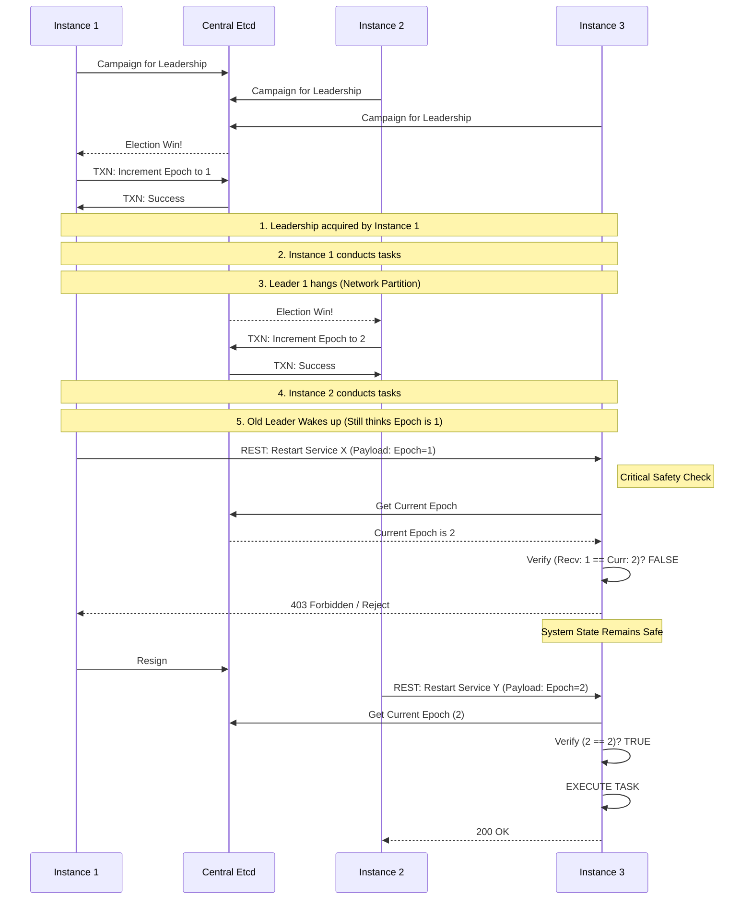

```mermaid
sequenceDiagram
    participant OldLeader as Instance 1
    participant DB as Central Etcd
    participant NewLeader as Instance 2
    participant Follower as Instance 3

    OldLeader->>DB: Campaign for Leadership
    NewLeader->>DB: Campaign for Leadership
    Follower->>DB: Campaign for Leadership
    DB-->>OldLeader: Election Win!
    OldLeader->>DB: TXN: Increment Epoch to 1
    DB->>OldLeader: TXN: Success

    Note over OldLeader, Follower: 1. Leadership acquired by Instance 1
    Note over OldLeader, Follower: 2. Instance 1 conducts tasks
    Note over OldLeader, Follower: 3. Leader 1 hangs (Network Partition)

    DB-->>NewLeader: Election Win!
    NewLeader->>DB: TXN: Increment Epoch to 2
    DB->>NewLeader: TXN: Success
    Note over OldLeader, Follower: 4. Instance 2 conducts tasks

    Note over OldLeader, Follower: 5. Old Leader Wakes up (Still thinks Epoch is 1)

    OldLeader->>Follower: REST: Restart Service X (Payload: Epoch=1)

    Note right of Follower: Critical Safety Check
    Follower->>DB: Get Current Epoch
    DB-->>Follower: Current Epoch is 2

    Follower->>Follower: Verify (Recv: 1 == Curr: 2)? FALSE
    Follower-->>OldLeader: 403 Forbidden / Reject

    Note over Follower: System State Remains Safe

    OldLeader->>DB: Resign

    NewLeader->>Follower: REST: Restart Service Y (Payload: Epoch=2)
    Follower->>DB: Get Current Epoch (2)
    Follower->>Follower: Verify (2 == 2)? TRUE
    Follower->>Follower: EXECUTE TASK
    Follower-->>NewLeader: 200 OK
```
